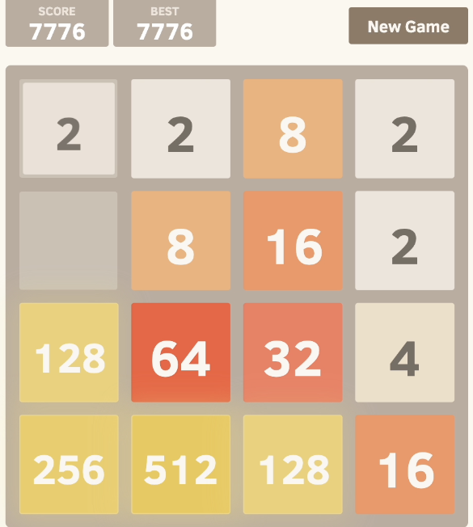

Training AI models on 2048 in  Python
===========

Based on the popular game [2048](https://github.com/gabrielecirulli/2048) by Gabriele Cirulli. The game's objective is to slide numbered tiles on a grid to combine them to create a tile with the number 2048. Here is a Python version that uses TKinter! 

We use different AI models to train the game to play itself. The models we use are:
* QLearning
* Deep QLearning

To start the game, run:
    
    $ python puzzle.py

Contributors for the code of the game:
==

- [Yanghun Tay](http://github.com/yangshun)
- [Emmanuel Goh](http://github.com/emman27)
